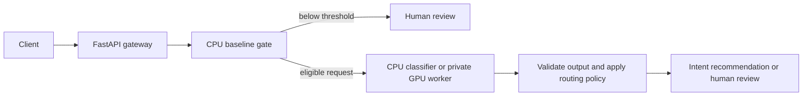

# Customer request triage

An English intent-classification project using CLINC150, with a FastAPI service
that recommends an intent or human review. It compares TF-IDF + logistic
regression, prompted Qwen3-0.6B and a QLoRA fine-tuned version of the same model.

## Features

- Reproducible data preparation, training and evaluation with pinned sources,
  dependency locks and artifact checksums.
- Routing policies selected on validation data, with explicit review decisions
  for low-confidence, out-of-scope and invalid model outputs.
- FastAPI endpoints with Pydantic validation, optional bearer authentication,
  request limits, health checks and private Prometheus metrics.
- CPU Docker deployment and a separate authenticated GPU inference worker.
- Saved A/B/C comparisons, error analysis, serving parity and load-test results.

## Results

Frozen test: 4,500 supported requests across 150 intents and 1,000 out-of-scope
requests. All candidates use the same test examples; thresholds were selected
on validation and fixed before testing.

| Measure | TF-IDF baseline | Prompted Qwen3-0.6B | QLoRA fine-tuned |
| --- | ---: | ---: | ---: |
| Supported macro-F1 | 0.8866 | 0.2785 | **0.9568** |
| Routing coverage | 60.05% | 0% | **70.65%** |
| Error among routed requests | 5.99% | Undefined | **4.76%** |
| Out-of-scope review recall | 92.7% | 100% (reviews everything) | **89.6%** |
| Invalid outputs / 5,500 | 0 | 1,032 | 44 |

**No candidate qualified for automatic release.** Fine-tuning improved supported
classification but missed the fixed 90% out-of-scope review requirement. The
service is a local research demonstration and performs no business actions.

See the [final comparison and confidence intervals](reports/milestone5-final-v1/README.md)
and [error analysis](docs/error_analysis.md). Coverage/error plots:
[baseline](reports/milestone5-final-v1/baseline-report/coverage_error.png),
[prompted](reports/milestone5-final-v1/prompted-report/coverage_error.png),
[fine-tuned](reports/milestone5-final-v1/finetuned-report/coverage_error.png).

## Quick start

Install **Python 3.11** and **uv 0.12.19**, then run from the repository root:

```console
uv sync --locked
uv run --locked python scripts/reproduce_cpu.py --output artifacts/reproduction-v1
```

The helper creates a fresh CPU environment, downloads and verifies CLINC150,
trains and reloads the baseline, evaluates 3,100 validation requests, selects a
policy, checks API parity and runs a live HTTP demo. The first run needs internet;
no GPU, Docker or model-hub account is required. Choose a new output directory
for each run. [Setup and troubleshooting](docs/setup.md).

Start the API using the reproduced model:

```console
uv run --locked triage serve --bundle artifacts/reproduction-v1/bundle --policy artifacts/reproduction-v1/policy/policy.json
```

Open **http://127.0.0.1:8000/docs** and try `POST /v1/triage`:

```json
{"text": "what is my account balance"}
```

The response contains `intent`, `decision` (`route` or `human_review`), `reason`,
model/policy versions and latency. Stop the server with **Ctrl+C**.
See the [API reference](docs/api.md) for schemas, status codes and limits, or
the [demo guide](docs/demo.md) for an automated presentation.

## Configuration

Pass runtime limits through `--config configs/service.yaml`. Model and training
settings live in `configs/`; GPU environments have separate locks under
`environments/`.

| Environment variable | Purpose | When unset |
| --- | --- | --- |
| `TRIAGE_API_KEY` | Bearer key for `/v1/triage` and `/v1/model` | Local API authentication disabled |
| `TRIAGE_METRICS_KEY` | Separate bearer key for `/metrics` | Metrics endpoint disabled |
| `TRIAGE_WORKER_KEY` | Shared secret between gateway and GPU worker | GPU worker cannot start |

Use distinct randomly generated keys. Native Python commands read process
environment variables; they **do not automatically load `.env`**. For Docker
Compose, copy [.env.example](.env.example) to `.env`, fill in the keys and pass
`--env-file .env`. The Compose configuration requires all three values.
[Deployment commands and credential setup](docs/deployment.md).

## Architecture



The CPU path reuses the baseline's prediction and score. The GPU path calls a
separate authenticated Transformers worker. The gateway enforces request and
inference limits and records metrics without logging raw request text.
[Architecture details](docs/architecture.md).

The verified GPU container matched all 3,100 validation outputs. A 500-request
serial workload achieved **1.345 requests/s** and **1.117-second p95** on a GTX
1650 (4 GB); concurrent workloads mostly received busy responses.
[Serving evidence](reports/milestone5-container-gpu-full-v1/README.md).
The separate [vLLM experiment](docs/vllm_experiment.md) changed some outputs and
was not adopted. Cloud deployment remains unverified.

## Development

```console
uv run --locked ruff check .
uv run --locked ruff format --check .
uv run --locked mypy
uv run --locked pytest -q
```

CPU CI is configured for Windows and Linux and includes a container check;
hosted execution remains unverified. The
[manual GPU fixture](docs/gpu_smoke.md) is opt-in and uses a tiny synthetic model.
[Current verification status](docs/implementation_status.md).

| Directory | Contents |
| --- | --- |
| `src/triage/` | Data, models, training, evaluation, routing and API |
| `scripts/` | Reproduction, demos and experiment verification |
| `tests/` | CPU unit and integration tests with synthetic fixtures |
| `configs/`, `prompts/`, `environments/` | Experiment settings, prompt and dependency locks |
| `deployment/` | Dockerfiles, Compose configuration and AWS runbook |
| [`reports/`](reports/README.md) | Saved predictions, comparisons, plots and execution evidence |
| `docs/` | Setup, cards, architecture, runbooks and implementation history |

Model weights, raw data and local environments are excluded from Git. CPU
weights are reproduced by the quick start. GPU use requires the documented
[training procedure](docs/finetuning.md) or trusted matching artifacts. Load
only trusted model bundles. [Developer handoff](docs/handoff.md).

## Data and licensing

CLINC150: Larson et al. (2019), *An Evaluation Dataset for Intent Classification
and Out-of-Scope Prediction*, from [clinc/oos-eval](https://github.com/clinc/oos-eval)
at commit `828f8093932c8fe6ca7936c3d2e52903b1c523de`.
[Retained CC BY 3.0 license](reports/baseline-c1-v1-val/CLINC_LICENSE.txt).

The project code's license is undecided. Dataset and model licenses remain
separate; see the [data card](docs/data_card.md) and [model card](docs/model_card.md).
Public benchmark results do not establish real customer performance. Known
duplicates and possible pretraining overlap are documented. The final test is
already consumed; do not rerun it to tune thresholds or replace the candidate.
