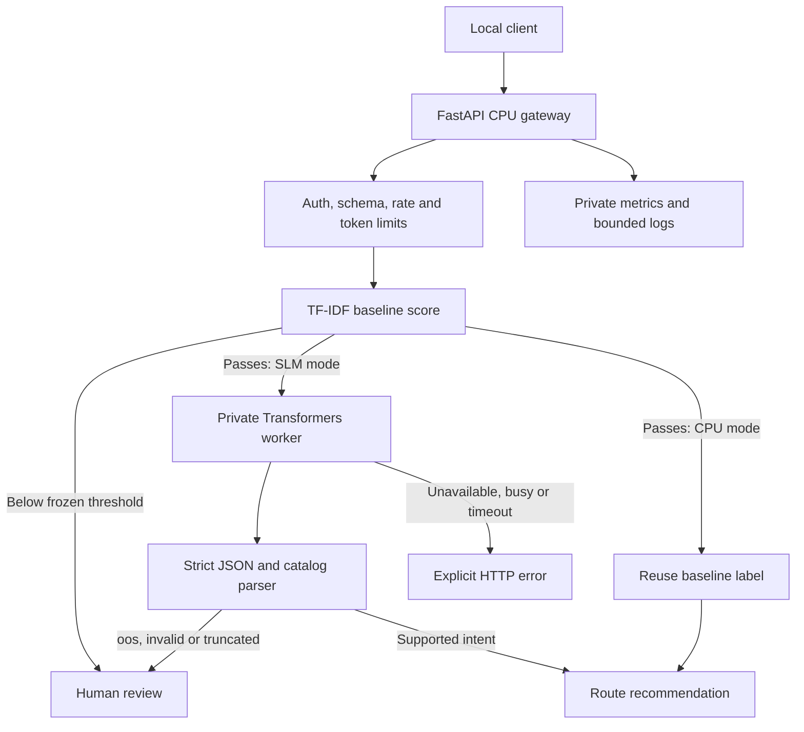

# Architecture and routing contract

The project separates model comparison, routing policy and serving. Requests
produce recommendations only; no downstream business system is connected.

If the policy disables routing, readiness/input validation precedes review
without gate or generation calls. In CPU mode the gate's already-computed label
is reused. In SLM mode A decides whether to call B/C; it never substitutes its
label for an unavailable SLM. Equality with the threshold passes. Unknown labels,
duplicate JSON keys, extra fields, prose and truncation cannot produce valid
supported routes. No confidence field is exposed.

## Offline versus online

Offline evaluation generates for every example, even those the gate rejects,
allowing separate raw and policy metrics. Online serving skips SLM generation
below threshold. Candidates share the ranking model but have individually
validation-selected thresholds. The baseline score is not calibrated open-set
uncertainty. Training's 100 oos examples do not change that interpretation.

LoRA changes small trainable matrices on a frozen quantized base. Completion-only
masking trains the JSON+EOS answer, not the supplied prompt. The paired B/C
comparison fixes the base, full catalog, precision and decoder. The older 4B
prompted result is separate from the paired 0.6B comparison.

## Processes and networks

The CPU service can run alone. The GPU profile has a private worker with no
published port, and a gateway on both private and frontend networks. Only port
8000 is published to localhost. Containers are non-root/read-only with read-only
artifact mounts, scratch space, dropped capabilities and no-new-privileges.
CPU Compose was executed; GPU runner topology was measured, while the GPU Compose
profile itself was not separately executed.

One inference slot bounds concurrency; a full slot returns 503 rather than
building an unbounded queue. Timeouts retain still-running work until it finishes;
Python cannot forcibly cancel native inference. Readiness reflects unavailable
work. Restart a stuck worker/gateway. This explains the measured busy responses
at concurrency 4/8 and does not establish scalable serving.

## Identity and release

Bundles bind pipeline/model, catalog, data manifest, package versions and policy
hashes. GPU identity additionally binds base revision, adapter, tokenizer/chat
template, system prompt and decoder. Frozen releases bind source and lock hashes.
Representation changes require a new evaluated variant. vLLM is retained
separately because unchanged model files still produced different outputs.

Selection used validation before the one-use frozen test. The activation command
refuses the disqualified release before writing an atomic pointer. No pointer is
active. Explicit `serve --bundle` is a local research/demo path, not production
approval. Rollback needs a previous accepted release; none exists here. Atomic
pointer behavior is unit-tested, not a real deployment. Do not bypass the guard.

## Observability

With `TRIAGE_METRICS_KEY`, `/metrics` exposes private Prometheus-compatible
counters and bounded latency summaries; it is absent without that key. API and
worker credentials are separate. Logs omit raw text, client IDs, headers and query
strings, but include status, timing, outcome/reason and model identity. Benchmarks
retain failed submissions: fast rejections are not successful latency/throughput.
Operational distributions can flag changes; reviewed labels establish accuracy.

See [API](api.md), [deployment](deployment.md), [model card](model_card.md)
and [setup](setup.md).
